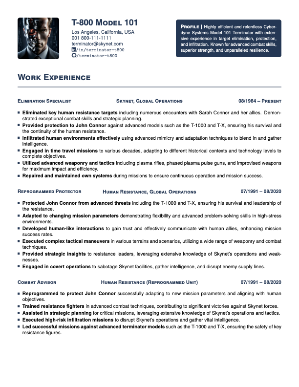
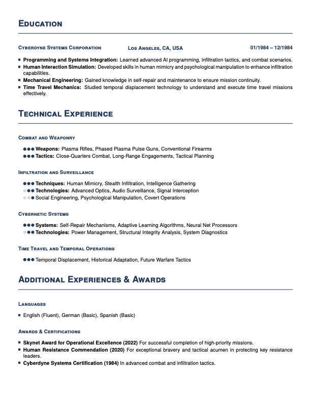

# Concise CV
This is a CV template that aims to be concise and to the point. It provides `LaTeX` commands to structure your CV, help you write it and make it easy to read. It can be easily themed and customized to fit your personal style.




## Installing / Getting started
You can use the provided development container to simplify the setup process. For more information, check out the [development container documentation](https://code.visualstudio.com/docs/remote/containers).

## Build your own CV
Use the provided example as a base to build your own CV and follow these steps:

### Document metadata
Fill in the document metadata. This will not show up in the document itself but is used to generate the PDF.

### Personal information
Fill in the ```\myXXYZ``` commands with your personal information. This will show up in the document header.

### Work experience
First section should be your work experience in reverse chronological order. Use the ```\whatwherewhen``` command to fill in the details for each position.
Afterwards, use ```\accomplishment``` commands contained in a ```cvEnum``` scope to list your achievements for this position. The command takes two text arguments: the first will be highlighted in bold, the second will be displayed normally.
For my CVs, I try to use the XYZ formula for each accomplishment: "I did X, which led to Y, as measured by Z", which is a good way to show the impact of your work <sub>[1](https://www.pathpire.com/blog/the-xyz-formula-for-resume-writing-transform-your-application/)[2](https://www.inc.com/bill-murphy-jr/google-recruiters-say-these-5-resume-tips-including-x-y-z-formula-will-improve-your-odds-of-getting-hired-at-google.html)[3](https://ultmeche.com/xyz-google-resume/)</sub>.

Try to use the `X` in the first argument to describe the task you did, the `Y` and `Z` in the second argument to describe the impact and measured impact. This will help you to structure your accomplishments and make them more concise and to the point.

```tex
\whatwherewhen{Elimination Specialist}{Skynet, Global Operations}{08/1984 \textendash\space Present}
\begin{cvEnum}
    \item \accomplishment{I did X,}{which led to Y, as measured by Z.}
    ...
\end{cvEnum}
```

### Education
Use the same syntax with the ```\whatwherewhen``` command to list your education. You can also use the ```\accomplishment``` command to list your thesis, majors, minors or other academic achievements.

### Technical Experience
In this section you should list your technical experience that is relevant to the job, such as programming languages, frameworks, tools, etc. Use the ```\skillEnum``` scope and specific ```\skills``` as shown below. Try to rank your skills according to your proficiency level (beginner/intermediate/expert). Be honout and expect the interviewer to ask you about your skills according to your ranking. The ```\skills``` command takes three arguments: the proficiency level where you can use the ```\beginner```, ```\intermediate``` and ```\expert``` commands, an optional label and acutal list of skills.

```tex
\subsection*{Infiltration and Surveillance}
\begin{skillEnum}
    \skills{\expert}[Techniques:]{Human Mimicry, Stealth Infiltration, Intelligence Gathering}
    \skills{\intermediate}[Technologies:]{Advanced Optics, Audio Surveillance, Signal Interception}
    \skills{\beginner}{Social Engineering, Psychological Manipulation, Covert Operations}
\end{skillEnum}
```

### Additional Experiences & Awards
Other accomplishments. Think about your volunteer work, awards, certifications, etc. Use the same syntax as for the work experience.

### Final touches
After finishing the semantic content of your CV, you can use the sizing parameters to adjust the font size, margins and spacing of the document. Use these to make sure your CV fits on one page and is easy to read.

Use the following options:
- `fontsize` changes the global font size of the document.
- `margin` changes the left, top, right and bottom margins of the document.
- `spacing` changes the vertical spacing between sections and bulletpoints.
- `primarycolor` changes the primary color of the document.

Example:
```
\documentclass[fontsize=10pt, margin=.5in, spacing=5pt, primarycolor=00003b]{concise-cv}
```

# Contribute
See [CONTRIBUTING](.github/CONTRIBUTING.md).

## Code of Conduct
See [CODE_OF_CONDUCT](.github/CODE_OF_CONDUCT.md).

# License
See [LICENSE](.github/LICENSE.md).