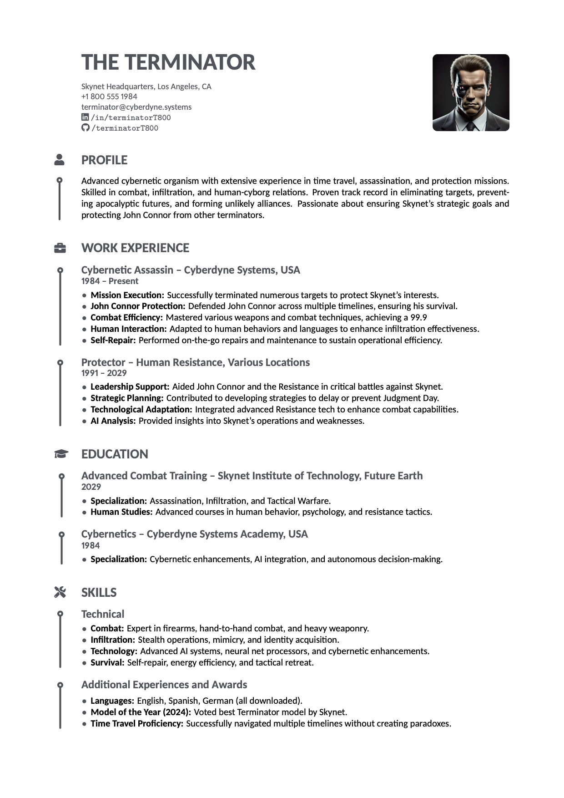
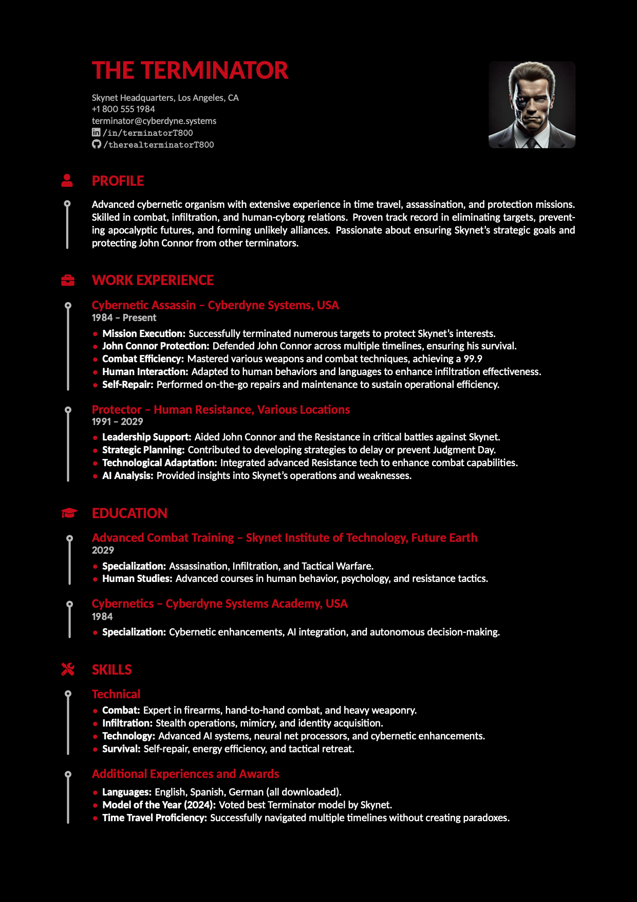

# Concise CV

## Introduction
This is a CV template that aims to be concise and to the point. It provides `LaTeX` commands to structure your CV, help you write it and make it easy to read. It can be easily themed and customized to fit your personal style.

## Examples
### Header with picture and profile

### Minimal header

## Installing / Getting started
You can use the provided development container to simplify the setup process. For more information, check out the [development container documentation](https://code.visualstudio.com/docs/remote/containers).

## Build your own CV
Use the provided example as a base to build your own CV.

### Final touches
After finishing the semantic content of your CV, you can use the sizing parameters to adjust the font size, margins and spacing of the document. Use these to make sure your CV fits on one page and is easy to read.

Use the following options:
- `fontsize`: Changes the global font size.
- `pagemargin`: Adjusts the document's margins.
- `spacing`: Alters vertical spacing between elements.
- `primarycolor`: Sets the primary color.
- `backgroundcolor`: Defines the background color.
- `textprimarycolor`: Specifies the primary text color.
- `textsecondarycolor`: Determines the secondary text color.
- `timelineindent`: Adjusts timeline indentation.
- `smallskip`: Sets the size of small vertical spaces.
- `bigskip`: Sets the size of large vertical spaces.
- `a4paper`: Option for A4 paper size.
- `letterpaper`: Option for Letter paper size.

# Contribute
See [CONTRIBUTING](.github/CONTRIBUTING.md).

## Code of Conduct
See [CODE_OF_CONDUCT](.github/CODE_OF_CONDUCT.md).

# License
See [LICENSE](.github/LICENSE.md).